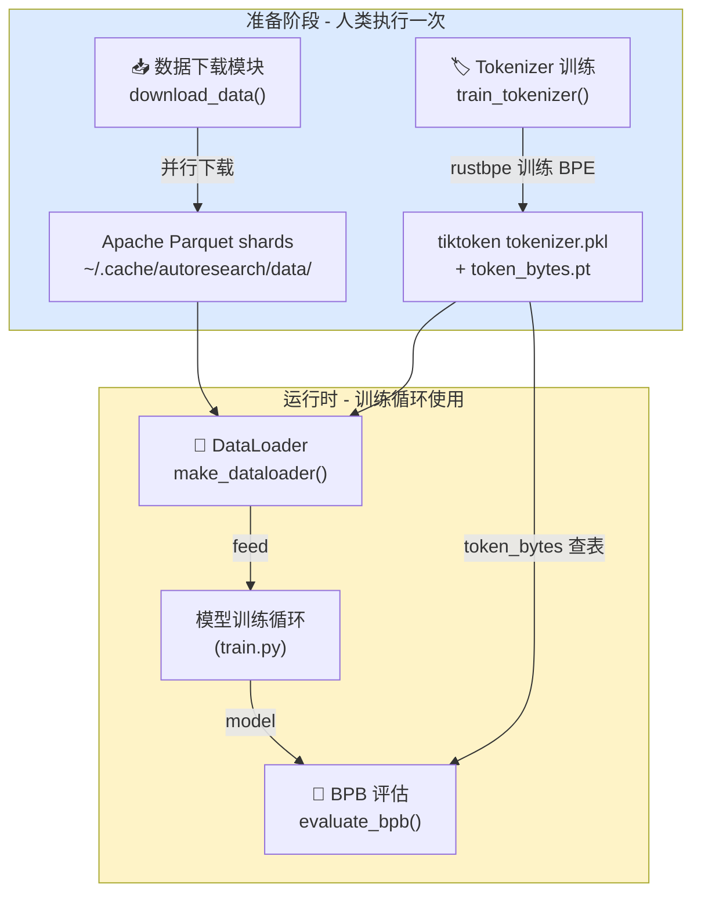
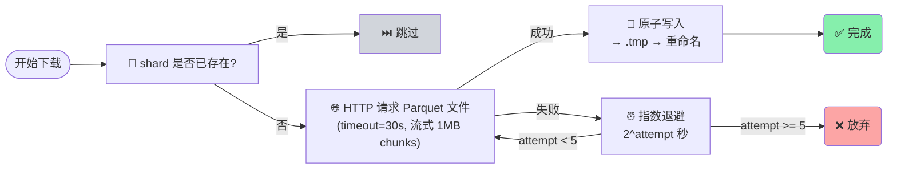
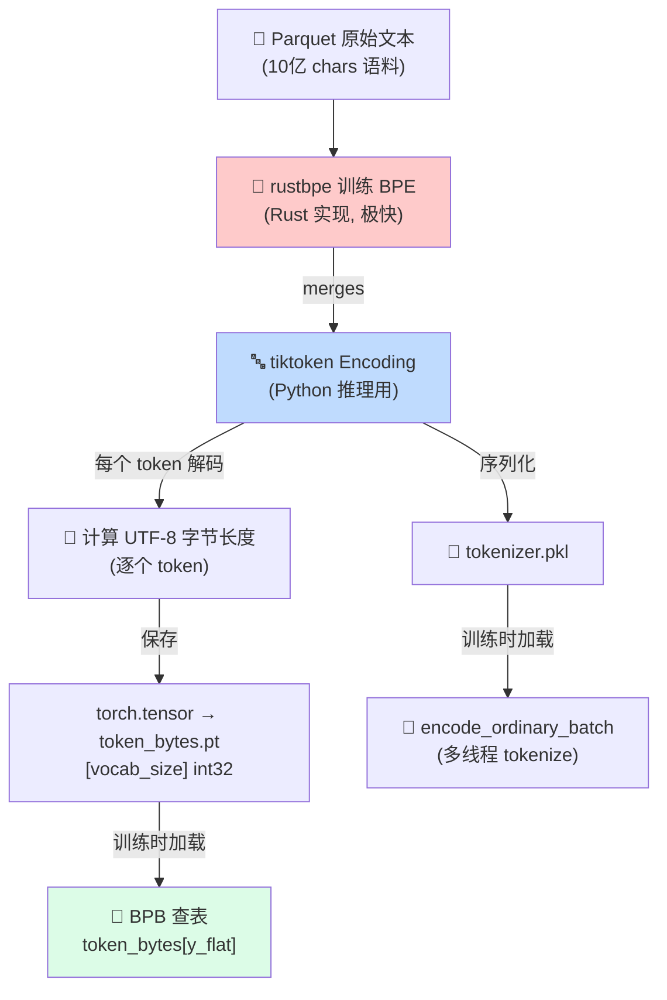
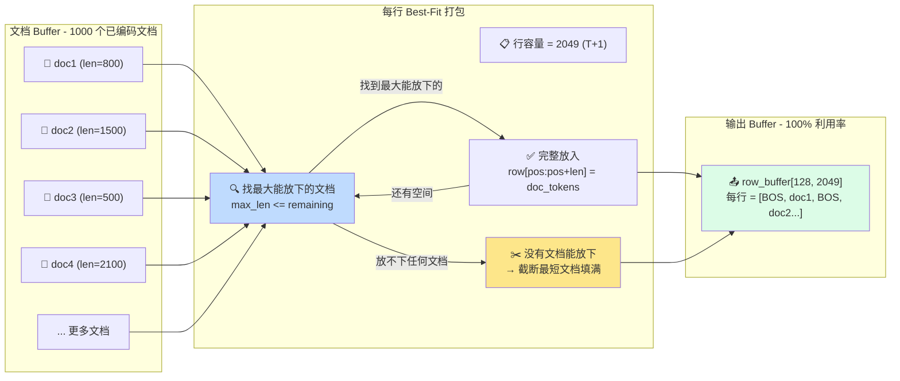
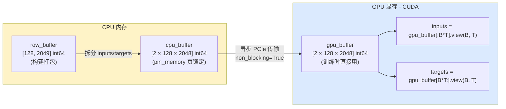
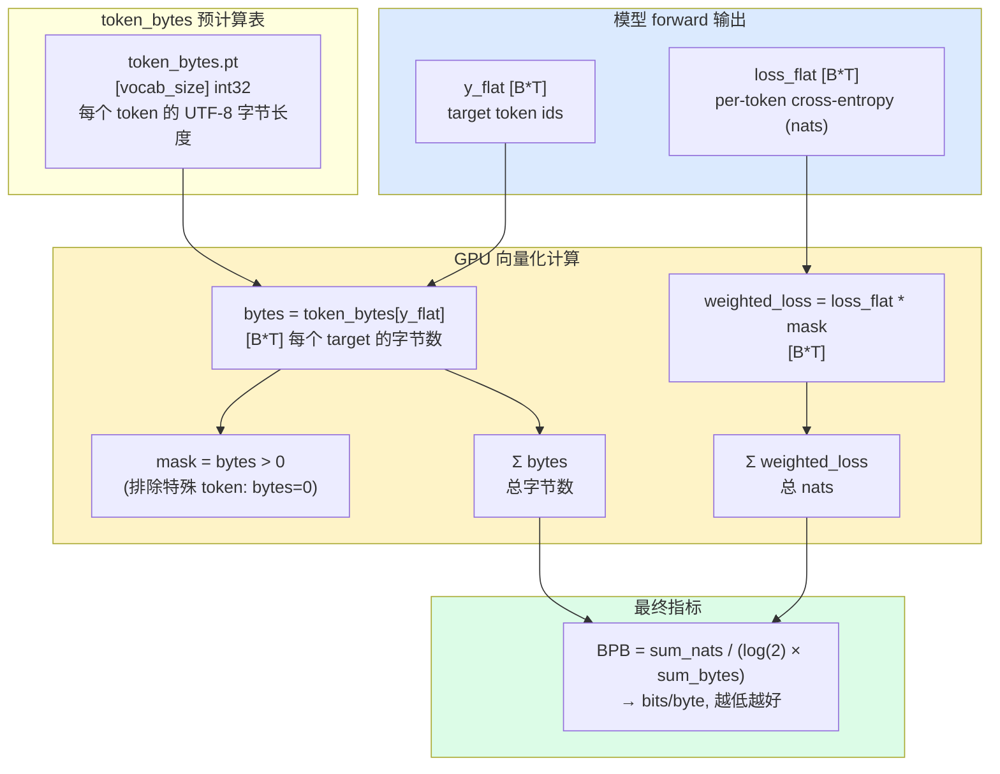

# prepare.py 详细分析

> **注意**：此文件是固定不变的（Agent 不可修改）。它提供了数据准备、tokenizer 训练、运行时数据加载和评估函数。

---

## 一、整体结构

```
prepare.py
├── 常量定义 (line 30-51)
│   ├── MAX_SEQ_LEN = 2048
│   ├── TIME_BUDGET = 300
│   ├── EVAL_TOKENS = 40 * 524288
│   ├── VOCAB_SIZE = 8192
│   ├── SPLIT_PATTERN (GPT-4 style BPE)
│   └── SPECIAL_TOKENS / BOS_TOKEN
│
├── 数据下载 (line 57-113)
│   ├── download_single_shard()  # 单个 shard 下载（含重试）
│   └── download_data()          # 并行下载多个 shards
│
├── Tokenizer 训练 (line 119-203)
│   ├── list_parquet_files()
│   ├── text_iterator()          # 从 parquet 流式读取文本
│   └── train_tokenizer()        # rustbpe 训练 → tiktoken 格式
│
├── 运行时工具 (line 209-337)
│   ├── Tokenizer 类             # tiktoken 包装器
│   ├── get_token_bytes()        # 加载预计算的 token→字节长度表
│   ├── _document_batches()      # parquet 文档流（无限迭代）
│   └── make_dataloader()        # BOS 对齐 + Best-Fit 打包
│
└── 评估 (line 343-365)
    └── evaluate_bpb()           # BPB 指标（固定评估）
```

---

### 1.1 prepare.py 模块功能图



---

## 二、常量详解

```python
# line 30-32
MAX_SEQ_LEN = 2048       # 训练/评估的上下文长度
TIME_BUDGET = 300        # 5分钟固定训练时间
EVAL_TOKENS = 40 * 524288  # 验证集评估 token 数量（约 21M tokens）

# line 38-45
CACHE_DIR = "~/.cache/autoresearch"
DATA_DIR = CACHE_DIR + "/data"      # 存放 .parquet 文件
TOKENIZER_DIR = CACHE_DIR + "/tokenizer"  # 存放 tokenizer.pkl + token_bytes.pt
BASE_URL = "huggingface.co/datasets/karpathy/climbmix-400b-shuffle"
MAX_SHARD = 6542       # 共 6543 个 parquet shards (0-6542)
VAL_SHARD = 6542       # 固定最后一个 shard 为验证集

# line 48 — BPE 分割模式（GPT-4 风格，但数字只匹配 1-2 位）
SPLIT_PATTERN = r'''
    '(?i:[sdmt]|ll|ve|re)              # 英文 contractions
    |[^\r\n\p{L}\p{N}]?+\p{L}+         # 单词（可选前导标点）
    |\p{N}{1,2}                        # 数字（1-2位，不同于 GPT-4 的 1-3位）
    | ?[^\s\p{L}\p{N}]++[\r\n]*        # 标点/符号块
    |\s*[\r\n]                         # 换行符
    |\s+(?!\S)                         # 尾随空格
    |\s+                               # 其他空白
'''
```

---

### 2.1 数据下载与重试机制流程图



---

## 三、数据下载（download_data）

### 3.1 单个文件下载

```python
def download_single_shard(index):
    """下载一个 parquet shard，带重试机制。"""
    # 已存在则跳过（幂等）
    if os.path.exists(filepath):
        return True
    
    # 5 次尝试，指数退避
    for attempt in range(1, 6):
        try:
            response = requests.get(url, stream=True, timeout=30)
            response.raise_for_status()
            # 先写到 .tmp，写完再 rename（原子操作，防止中断产生坏文件）
            with open(temp_path, "wb") as f:
                for chunk in response.iter_content(chunk_size=1024*1024):
                    if chunk:
                        f.write(chunk)
            os.rename(temp_path, filepath)
            return True
        except Exception as e:
            # 清理失败文件
            for path in [filepath + ".tmp", filepath]:
                if os.path.exists(path):
                    os.remove(path)
            if attempt < max_attempts:
                time.sleep(2 ** attempt)  # 指数退避：2, 4, 8, 16 秒
    return False
```

### 3.2 并行下载

```python
with Pool(processes=download_workers) as pool:  # 默认 8 进程
    results = pool.map(download_single_shard, ids)
```

**关键设计：**
- 总是同时下载训练 shards + 验证 shard
- 已存在的 shard 不重复下载
- 原子写入（先 .tmp 再 rename）防止中断产生损坏文件
- 每个 shard 独立 5 次重试 + 指数退避

---

## 四、Tokenizer 训练（train_tokenizer）

### 4.1 训练流程

```
训练数据: 所有 parquet 文件，流式读取（不一次性加载到内存）
最大字符: 10亿 chars (约 500MB 文本)
每个文档: 截断到 10000 字符（防止超长文档阻塞）

Step 1: rustbpe 训练 BPE（Rust 实现，极快）
  tokenizer = rustbpe.Tokenizer()
  tokenizer.train_from_iterator(text_iterator(), vocab_size_no_special, pattern)

Step 2: 转换为 tiktoken Encoding（Python 推理使用）
  mergeable_ranks = {bytes(k): v for k, v in tokenizer.get_mergeable_ranks()}
  enc = tiktoken.Encoding(name="rustbpe", pat_str=..., mergeable_ranks=..., special_tokens=...)

Step 3: 保存 pickle
  pickle.dump(enc, tokenizer_pkl)

Step 4: 构建 token_bytes 查找表（用于 BPB 评估）
  对每个 token_id:
    token_str = enc.decode([token_id])
    token_bytes_list.append(len(token_str.encode("utf-8")))
  torch.save(token_bytes_tensor, token_bytes.pt)

Step 5:  sanity check (encode/decode roundtrip)
```

### 4.2 为什么用 rustbpe + tiktoken？

| 工具 | 用途 | 优势 |
|-----|------|------|
| rustbpe | 训练 BPE | 纯 Rust，比 HuggingFace tokenizers 更快 |
| tiktoken | 推理时编码/解码 | OpenAI 官方实现，Python 接口友好 |

### 4.3 token_bytes.pt 的作用

这是 BPB 评估的关键：对每个 token id，存储其 UTF-8 编码的字节长度。例如：
- 英文 token "hello" → 5 bytes
- 中文 token "你好" → 6 bytes（每个中文字符 3 bytes UTF-8）
- 特殊 token `<|reserved_0|>` → 0 bytes（排除在 BPB 计算之外）

在评估时直接查表 `token_bytes[y_flat]`，避免每次都做 UTF-8 编码。

---

### 4.1 Tokenizer 训练与转换流水线



---

## 五、DataLoader 详解（make_dataloader）

这是整个项目中最高效、最精巧的部分之一。

### 5.1 设计目标

```
目标: 100% 序列利用率，0 padding
传统 DataLoader 问题:
  - 文档长度不一 → 需要 padding → 浪费计算
  - 简单拼接多个文档 → 文档边界信息丢失
解决方案: BOS 对齐 + Best-Fit 打包
```

### 5.2 打包算法（Best-Fit）

```
对每一行 (长度 T+1):
    pos = 0
    while pos < row_capacity:
        # Step 1: 找最大的能完全放下的文档
        best_idx = -1
        best_len = 0
        for i, doc in enumerate(doc_buffer):
            doc_len = len(doc)
            if doc_len <= remaining and doc_len > best_len:  # 最大优先
                best_idx = i
                best_len = doc_len
        
        if best_idx >= 0:
            # 能放下 → 完整放入
            doc = doc_buffer.pop(best_idx)
            row_buffer[row_idx, pos:pos+len(doc)] = doc
            pos += len(doc)
        else:
            # 没有文档能放下 → 截断最短的文档填满
            shortest_idx = min(doc_buffer, key=len)
            doc = doc_buffer.pop(shortest_idx)
            row_buffer[row_idx, pos:pos+remaining] = doc[:remaining]
            pos += remaining  # 填满了
```

### 5.2.1 Best-Fit 打包算法可视化



**算法特点：**
- 每次都找"最大的能放下"的文档 → 减少浪费
- 当行尾有剩余空间但没有文档能完整放下时，截断最短文档填满
- Buffer 中始终有 1000 个文档，确保有足够选择空间
- **100% 利用率**：每行都是恰好 T+1 个 token

### 5.3 内存布局

```python
# 行 buffer（CPU，用于构建）
row_buffer = torch.empty((B, row_capacity), dtype=torch.long)  # (B, T+1)

# 异步传输 buffer
cpu_buffer = torch.empty(2 * B * T, dtype=torch.long, pin_memory=True)
    ├── cpu_inputs = cpu_buffer[:B*T].view(B, T)   # inputs
    └── cpu_targets = cpu_buffer[B*T:].view(B, T)  # targets

# GPU 侧 buffer
gpu_buffer = torch.empty(2 * B * T, dtype=torch.long, device="cuda")
    ├── inputs = gpu_buffer[:B*T].view(B, T)
    └── targets = gpu_buffer[B*T:].view(B, T)

# 构建完成后，inputs = row_buffer[:, :-1], targets = row_buffer[:, 1:]
# 即 target 是 input 右移一位
```

### 5.4 传输优化

```python
# 每一行构建完成后
cpu_inputs.copy_(row_buffer[:, :-1])   # 0..T-1
cpu_targets.copy_(row_buffer[:, 1:])   # 1..T
gpu_buffer.copy_(cpu_buffer, non_blocking=True)  # 异步 PCIe 传输
yield inputs, targets, epoch
```

使用 **pin_memory + non_blocking=True** 使得 CPU→GPU 的传输可以与下一行构建重叠执行（流水线化）。

### 5.5 BOS 对齐

每个文档以 `BOS_TOKEN` 开头。这意味着：
- 每一行的第一个 token 总是 BOS
- 模型可以用 BOS 的存在来检测文档边界
- 文档之间不需要额外的分隔符

---

### 5.4 DataLoader 内存流水线图



---

## 六、BPB 评估函数（evaluate_bpb）

```python
@torch.no_grad()
def evaluate_bpb(model, tokenizer, batch_size):
    """Bits Per Byte: 与词表大小无关的评估指标"""
    
    # Step 1: 加载 token → 字节长度映射 (shape: [vocab_size])
    token_bytes = get_token_bytes(device="cuda")
    
    # Step 2: 创建验证集 dataloader (固定 MAX_SEQ_LEN=2048)
    val_loader = make_dataloader(tokenizer, batch_size, MAX_SEQ_LEN, "val")
    
    # Step 3: 计算评估步数
    steps = EVAL_TOKENS // (batch_size * MAX_SEQ_LEN)
    
    # Step 4: 累积损失和字节数
    total_nats = 0.0
    total_bytes = 0
    for _ in range(steps):
        x, y, _ = next(val_loader)
        
        # reduction='none' → 得到每个 token 的 loss (nats)
        loss_flat = model(x, y, reduction='none').view(-1)  # [B*T]
        y_flat = y.view(-1)  # [B*T]
        
        nbytes = token_bytes[y_flat]  # 每个 target token 的字节长度 [B*T]
        mask = nbytes > 0  # 排除特殊 token (字节长度=0)
        
        total_nats += (loss_flat * mask).sum().item()
        total_bytes += nbytes.sum().item()
    
    # Step 5: 转换 nats/byte → bits/byte
    return total_nats / (math.log(2) * total_bytes)
```

### 数学推导

```
BPB = (1 / log(2)) × (Σ loss_i × bytes_i) / (Σ bytes_i)

其中:
  - loss_i = -log P(token_i | context)  (cross-entropy, nats)
  - bytes_i = UTF-8 字节长度
  - log(2) ≈ 0.693 (转换系数: 1 nat = log2(e) bits)

直观理解:
  "平均每个字节需要多少比特来编码"
  - 完美压缩（熵为0）: BPB = 0
  - 随机字节: BPB = 8
  - 好的 LLM: BPB ≈ 0.5-1.5（取决于数据）
```

### 与 Perplexity 的对比

| 指标 | 依赖词表 | 依赖 tokenization | 可跨模型比较 |
|-----|---------|-----------------|------------|
| Perplexity | ✅ 依赖 | ✅ 依赖 | ❌ |
| BPB | ❌ 不依赖 | ❌ 不依赖 | ✅ |

### 6.1 BPB 计算数据流图



这对于 autoresearch 至关重要：Agent 可能会修改词表大小，BPB 仍然是公平的比较基准。

---

## 七、Tokenizer 包装类

```python
class Tokenizer:
    def __init__(self, enc):
        self.enc = enc  # tiktoken Encoding
        self.bos_token_id = enc.encode_single_token(BOS_TOKEN)
    
    @classmethod
    def from_directory(cls, tokenizer_dir=TOKENIZER_DIR):
        with open(os.path.join(tokenizer_dir, "tokenizer.pkl"), "rb") as f:
            enc = pickle.load(f)
        return cls(enc)
    
    def get_vocab_size(self):
        return self.enc.n_vocab
    
    def encode(self, text, prepend=None, num_threads=8):
        # text 可以是 str 或 list[str]
        # prepend 可以是 token id (int) 或 token string
        if isinstance(text, str):
            ids = self.enc.encode_ordinary(text)
            if prepend is not None:
                ids.insert(0, prepend_id)
        elif isinstance(text, list):
            ids = self.enc.encode_ordinary_batch(text, num_threads=num_threads)
            if prepend is not None:
                for row in ids:
                    row.insert(0, prepend_id)
        return ids
    
    def decode(self, ids):
        return self.enc.decode(ids)
```

---

## 八、文档批处理流（_document_batches）

```python
def _document_batches(split, tokenizer_batch_size=128):
    """无限迭代器，循环读取所有 parquet 文件的文档。"""
    
    # train split: 排除最后一个 shard
    # val split: 只读取最后一个 shard
    parquet_paths = [...]
    
    epoch = 1
    while True:  # 无限循环
        for filepath in parquet_paths:
            pf = pq.ParquetFile(filepath)
            for rg_idx in range(pf.num_row_groups):
                rg = pf.read_row_group(rg_idx)
                batch = rg.column('text').to_pylist()
                # 按 tokenizer_batch_size=128 分块
                for i in range(0, len(batch), tokenizer_batch_size):
                    yield batch[i:i+tokenizer_batch_size], epoch
        epoch += 1
```

**流式设计**：不会把所有数据加载到内存，而是按需从磁盘读取。对于 6543 个 shards 的数据集，这是必要的。

---

## 九、设计要点总结

| 设计决策 | 文件位置 | 技术意义 |
|---------|---------|---------|
| BPB 指标 | line 343-365 | 与词表/tokenization 无关 |
| 预计算 token_bytes | line 184-195 | 评估时避免 UTF-8 编码开销 |
| Best-Fit 打包 | line 305-333 | 100% 序列利用率 |
| BOS 对齐 | line 324-325 | 明确文档边界 |
| pin_memory + async copy | line 334-337 | CPU→GPU 传输流水线 |
| 原子文件写入 | line 72-75 | 防止中断产生损坏文件 |
| 指数退避重试 | line 87 | 网络不稳定时鲁棒 |
| 流式数据读取 | line 125-138 | 大数据集不 OOM |
| Fixed val shard | line 43 | 验证集固定，结果可比 |
