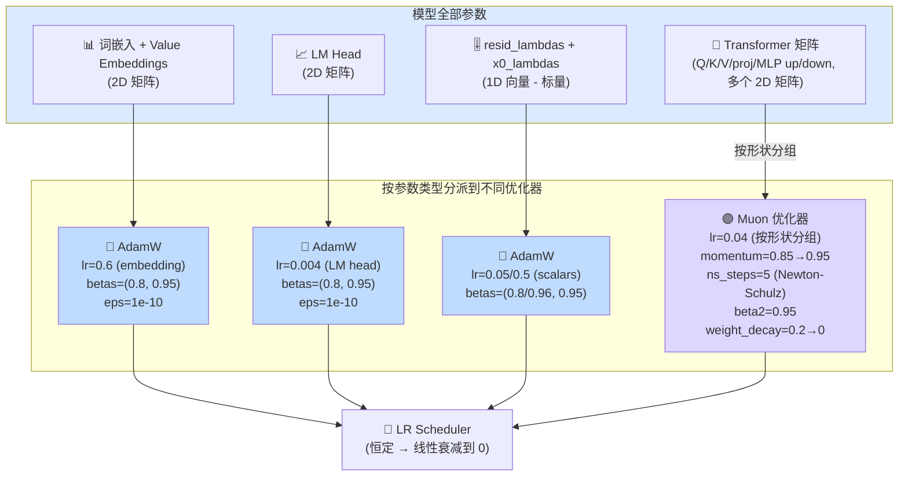
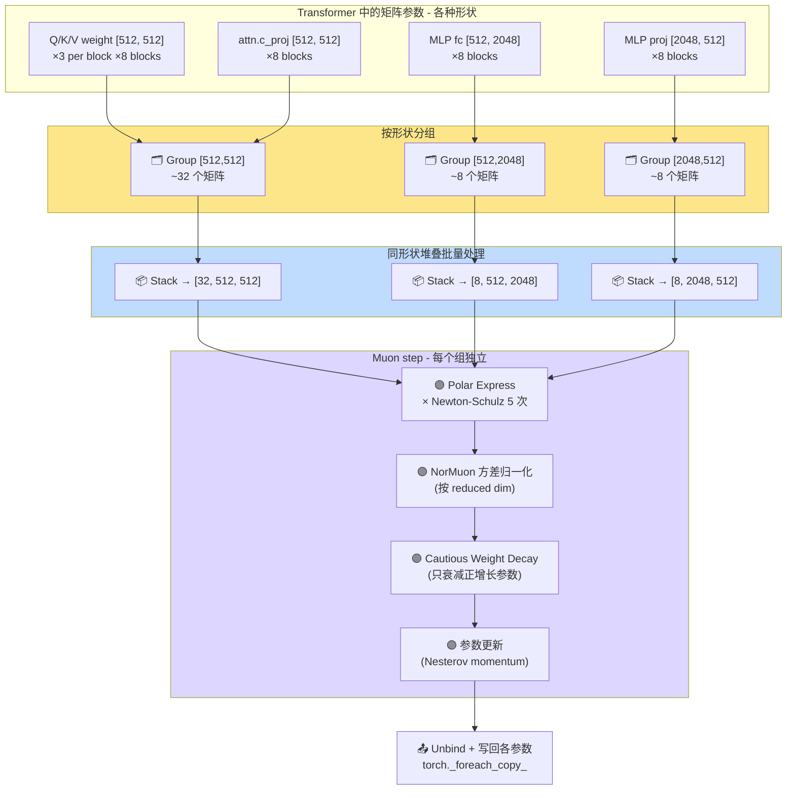
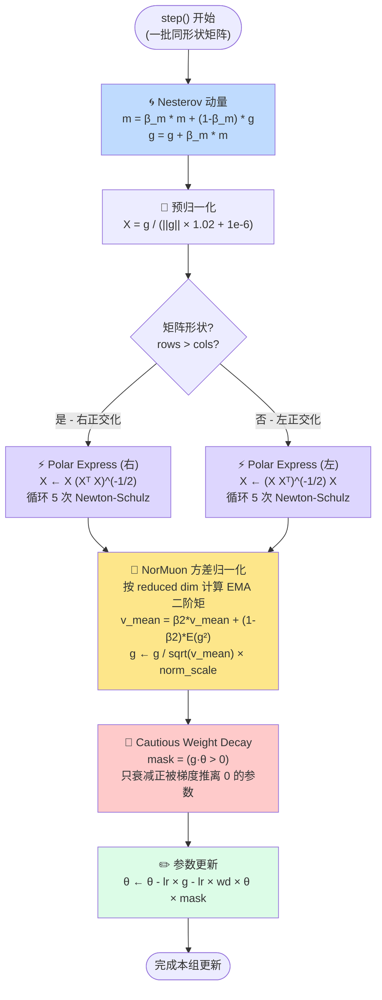

# train.py 详解（二）：Muon 优化器 + AdamW 混合策略

> 此文件分析优化器设计。Muon（Momentumized Orthogonal optimizer）是针对神经网络矩阵参数的专用优化器，是本项目最前沿的技术之一。

---

## 一、参数分组策略

不同类型的参数使用不同的优化器和学习率：

```python
def setup_optimizer(self, unembedding_lr=0.004, embedding_lr=0.2,
                    matrix_lr=0.02, weight_decay=0.0,
                    adam_betas=(0.8, 0.95), scalar_lr=0.5):
    """按参数类型分组，使用不同优化策略"""
    
    # 实际运行时的默认值 (train.py:438-444):
    #   EMBEDDING_LR = 0.6
    #   UNEMBEDDING_LR = 0.004
    #   MATRIX_LR = 0.04
    #   SCALAR_LR = 0.5
    #   WEIGHT_DECAY = 0.2
    #   ADAM_BETAS = (0.8, 0.95)
```

### 0.1 优化器整体架构图：Muon + AdamW 混合策略



### 参数组配置表

| 参数组 | 优化器 | 学习率 | 说明 |
|--------|--------|--------|------|
| LM Head (输出投影) | AdamW | 0.004 × lr_scale | 从模型维度到词表的投影 |
| Token Embedding | AdamW | 0.6 × lr_scale | 词嵌入（输入侧）|
| Value Embeddings | AdamW | 0.6 × lr_scale | ResFormer 的 value embeddings |
| resid_lambdas | AdamW | 0.05 (0.5 × 0.01) | 残差路径标量（较慢）|
| x0_lambdas | AdamW | 0.5 | x0 shortcut 标量（较快）|
| Transformer 矩阵 | Muon | 0.04（按形状分组） | 所有 2D 权重矩阵（Q/K/V/proj/MLP）|

### LR Scale 与模型维度

```python
# 学习率按 1/sqrt(d_model) 缩放（768 为基准）
dmodel_lr_scale = (model_dim / 768) ** -0.5
# 例如 model_dim=512: scale = (512/768)^-0.5 = sqrt(1.5) ≈ 1.225
```

**直觉**：小模型每个维度的"信息量"更大，需要更大的学习率；大模型反之。

### 按形状分组 Muon

```python
for shape in sorted({p.shape for p in matrix_params}):
    group_params = [p for p in matrix_params if p.shape == shape]
    param_groups.append(dict(
        kind='muon',
        params=group_params,
        lr=matrix_lr,
        momentum=0.95,
        ns_steps=5,
        beta2=0.95,
        weight_decay=weight_decay,
    ))
```

**为什么按形状分组？**
- 相同形状的矩阵可以堆叠成 3D tensor 一起处理（batch 处理提高效率）
- 共享动量 buffer（momentum_buffer）和二阶动量 buffer
- 减少内存碎片和 kernel launch 开销

### 1.1 Muon 按形状分组与堆叠处理



---

## 二、Muon 核心算法详解

### 2.1 三个核心组件

```
Muon 更新 = Polar Express 正交化 + NorMuon 方差减少 + Cautious Weight Decay
           (保持权重矩阵的正交性)     (归一化梯度尺度)      (智能 L2 正则)
```

### 2.1.1 Muon 核心算法：五步更新流程图



### 2.2 Polar Express 正交化

**直觉**：神经网络中的矩阵参数往往近似正交（尤其是在良好初始化和训练条件下）。Muon 在更新后将投影回正交矩阵集合。

```python
polar_express_coeffs = [
    (8.156554524902461, -22.48329292557795, 15.878769915207462),
    (4.042929935166739, -2.808917465908714, 0.5000178451051316),
    (3.8916678022926607, -2.772484153217685, 0.5060648178503393),
    (3.285753657755655, -2.3681294933425376, 0.46449024233003106),
    (2.3465413258596377, -1.7097828382687081, 0.42323551169305323),
]
```

**正交化迭代公式**（迭代 5 次）：

```
对于行多于列的矩阵:
  A = X^T X                  # [D_out, D_out]
  X = a * X + X @ (b*A + c*A²)  # 多项式近似 X ← X (X^T X)^(-1/2)

对于列多于行的矩阵:
  A = X @ X^T                # [D_in, D_in]
  X = a * X + (b*A + c*A²) @ X
```

**数学原理**：这是 Newton-Schulz 迭代的变体，用于计算矩阵的极分解（Polar Decomposition）中的正交因子。系数 `(a, b, c)` 是预计算的最优系数。

### 2.3 NorMuon 方差减少

**直觉**：不同形状的矩阵有不同的"梯度尺度"，需要归一化以获得相似的有效学习率。

```python
# 1. 计算二阶矩（均值）
beta2 = 0.95
v_mean = g.float().square().mean(dim=red_dim, keepdim=True)
# 累积: second_momentum_buffer.lerp_(v_mean, 1 - beta2)

# 2. 计算归一化因子
#    对于形状 [B, D_out, D_in]:
#    red_dim = -1 (D_in) if D_out >= D_in else -2 (D_out)
v_norm_sq = v_mean.sum(dim=(-2, -1), keepdim=True) * red_dim_size
v_norm = v_norm_sq.sqrt()

# 3. 应用归一化
step_size = second_momentum_buffer.clamp_min(1e-10).rsqrt()
scaled_sq_sum = (v_mean * red_dim_size) * step_size.float().square()
v_norm_new = scaled_sq_sum.sum(dim=(-2, -1), keepdim=True).sqrt()
final_scale = step_size * (v_norm / v_norm_new.clamp_min(1e-10))
g = g * final_scale.to(g.dtype)
```

### 2.4 Cautious Weight Decay

**直觉**：不是像标准 AdamW 那样均匀衰减所有参数，而是只衰减"正在增长"的参数。

```python
# mask = 1 当梯度和参数同号（参数正在增长）
mask = (g * stacked_params) >= 0

# 更新: θ = θ - lr * g - lr * wd * θ * mask
stacked_params.sub_(lr * g + lr * wd * stacked_params * mask)
```

### 2.4.1 Cautious Weight Decay 行为对比图

```mermaid
graph LR
    subgraph 标准 AdamW
        S1["θ > 0, g > 0<br/>(正增长)"] → D1["❌ 衰减 θ<br/>(正确)"]
        S2["θ > 0, g < 0<br/>(正在减小)"] → D2["❌ 仍衰减 θ<br/>(过度正则化!)"]
        S3["θ < 0, g < 0<br/>(负增长)"] → D3["❌ 衰减 θ<br/>(正确)"]
        S4["θ < 0, g > 0<br/>(正在减小)"] → D4["❌ 仍衰减 θ<br/>(过度正则化!)"]
    end

    subgraph Cautious WD
        C1["θ > 0, g > 0<br/>(正增长)"] → E1["✅ 衰减 θ<br/>(聪明!)"]
        C2["θ > 0, g < 0<br/>(正在减小)"] → E2["✅ 不衰减<br/>(让它自然减小!)"]
        C3["θ < 0, g < 0<br/>(负增长)"] → E3["✅ 衰减 θ<br/>(聪明!)"]
        C4["θ < 0, g > 0<br/>(正在减小)"] → E4["✅ 不衰减<br/>(让它自然减小!)"]
    end

    style 标准 AdamW fill:#fee2e2
    style Cautious WD fill:#dcfce7
```

**条件简记**：`mask = (g × θ > 0)` → 只在"梯度和参数同号"时衰减。

**对比**：

| 方法 | 公式 | 行为 |
|-----|------|------|
| 标准 L2 | `θ ← θ - lr*g - lr*wd*θ` | 所有参数向 0 衰减 |
| AdamW | `θ ← (1-lr*wd)*θ - lr*g` | 所有参数按比例衰减 |
| **Cautious WD** | `θ ← θ - lr*g - lr*wd*θ*[g·θ>0]` | **只衰减正被梯度推离 0 的参数** |

**Cautious WD 的直觉**：
- 如果 `θ > 0` 且 `g > 0`（梯度让 θ 更大）→ 衰减 θ（正则化过度增长）
- 如果 `θ > 0` 且 `g < 0`（梯度让 θ 变小）→ 不衰减（让它自然减小）
- 如果 `θ < 0` 且 `g < 0` → 衰减（|θ| 增大）
- 如果 `θ < 0` 且 `g > 0` → 不衰减（|θ| 减小）

---

## 三、muon_step_fused 完整流程

```python
@torch.compile(dynamic=False, fullgraph=True)
def muon_step_fused(stacked_grads, stacked_params, momentum_buffer,
                    second_momentum_buffer, momentum_t, lr_t, wd_t,
                    beta2_t, ns_steps, red_dim):
    """Muon 单步更新（全图编译）"""
    
    # ===== Step 1: Nesterov 动量 =====
    # m = beta * m + (1-beta) * g
    momentum = momentum_t.to(stacked_grads.dtype)
    momentum_buffer.lerp_(stacked_grads, 1 - momentum)
    
    # g = g + beta * m (Nesterov: 前瞻梯度)
    g = stacked_grads.lerp_(momentum_buffer, momentum)
    
    # ===== Step 2: Polar Express 正交化 =====
    X = g.bfloat16()
    X = X / (X.norm(dim=(-2, -1), keepdim=True) * 1.02 + 1e-6)  # 预归一化
    
    if g.size(-2) > g.size(-1):
        # 行多于列 → 右正交化: X ← X (X^T X)^(-1/2)
        for a, b, c in polar_express_coeffs[:ns_steps]:
            A = X.mT @ X
            B = b * A + c * (A @ A)
            X = a * X + X @ B
    else:
        # 列多于行 → 左正交化: X ← (X X^T)^(-1/2) X
        for a, b, c in polar_express_coeffs[:ns_steps]:
            A = X @ X.mT
            B = b * A + c * (A @ A)
            X = a * X + B @ X
    
    g = X  # [B, D_out, D_in]
    
    # ===== Step 3: NorMuon 方差减少 =====
    beta2 = beta2_t.to(g.dtype)
    v_mean = g.float().square().mean(dim=red_dim, keepdim=True)
    red_dim_size = g.size(red_dim)
    v_norm_sq = v_mean.sum(dim=(-2, -1), keepdim=True) * red_dim_size
    v_norm = v_norm_sq.sqrt()
    
    second_momentum_buffer.lerp_(v_mean.to(dtype=second_momentum_buffer.dtype), 1 - beta2)
    step_size = second_momentum_buffer.clamp_min(1e-10).rsqrt()
    scaled_sq_sum = (v_mean * red_dim_size) * step_size.float().square()
    v_norm_new = scaled_sq_sum.sum(dim=(-2, -1), keepdim=True).sqrt()
    final_scale = step_size * (v_norm / v_norm_new.clamp_min(1e-10))
    g = g * final_scale.to(g.dtype)
    
    # ===== Step 4: Cautious Weight Decay + 参数更新 =====
    lr = lr_t.to(g.dtype)
    wd = wd_t.to(g.dtype)
    mask = (g * stacked_params) >= 0
    stacked_params.sub_(lr * g + lr * wd * stacked_params * mask)
```

---

## 四、AdamW 步骤（非矩阵参数）

```python
@torch.compile(dynamic=False, fullgraph=True)
def adamw_step_fused(p, grad, exp_avg, exp_avg_sq, step_t,
                     lr_t, beta1_t, beta2_t, eps_t, wd_t):
    """标准 AdamW，但用 0-dim tensor 参数（使编译稳定）"""
    
    # Weight decay (解耦)
    p.mul_(1 - lr_t * wd_t)
    
    # 一阶矩 (动量)
    exp_avg.lerp_(grad, 1 - beta1_t)
    
    # 二阶矩
    exp_avg_sq.lerp_(grad.square(), 1 - beta2_t)
    
    # Bias correction
    bias1 = 1 - beta1_t ** step_t
    bias2 = 1 - beta2_t ** step_t
    
    # 更新
    denom = (exp_avg_sq / bias2).sqrt() + eps_t
    step_size = lr_t / bias1
    p.add_(exp_avg / denom, alpha=-step_size)
```

**注意**：所有超参数（lr, beta1, beta2, eps, wd）都是 0-dim CPU tensor。这是为了 `torch.compile` 不会因为 Python 标量值变化而重新编译。

---

## 五、MuonAdamW 优化器类

### 5.1 初始化

```python
class MuonAdamW(torch.optim.Optimizer):
    def __init__(self, param_groups):
        super().__init__(param_groups, defaults={})
        
        # 0-dim CPU tensors（避免重新编译）
        self._adamw_step_t = torch.tensor(0.0, dtype=torch.float32, device="cpu")
        self._adamw_lr_t = torch.tensor(0.0, dtype=torch.float32, device="cpu")
        # ... (同理 beta1, beta2, eps, wd; muon 的 momentum, lr, wd, beta2)
```

**关键设计**：0-dim CPU tensors。每次调用 step 时只需要 `fill_()` 更新值，torch.compile 看到的是稳定的 tensor，不会触发重新编译。

### 5.2 AdamW 组更新

```python
def _step_adamw(self, group):
    for p in group['params']:
        if p.grad is None:
            continue
        grad = p.grad
        state = self.state[p]
        
        if not state:  # 初始化
            state['step'] = 0
            state['exp_avg'] = torch.zeros_like(p)
            state['exp_avg_sq'] = torch.zeros_like(p)
        
        state['step'] += 1
        self._adamw_step_t.fill_(state['step'])
        self._adamw_lr_t.fill_(group['lr'])
        self._adamw_beta1_t.fill_(group['betas'][0])
        self._adamw_beta2_t.fill_(group['betas'][1])
        self._adamw_eps_t.fill_(group['eps'])
        self._adamw_wd_t.fill_(group['weight_decay'])
        
        adamw_step_fused(p, grad, state['exp_avg'], state['exp_avg_sq'],
                        self._adamw_step_t, self._adamw_lr_t,
                        self._adamw_beta1_t, self._adamw_beta2_t,
                        self._adamw_eps_t, self._adamw_wd_t)
```

### 5.3 Muon 组更新（核心）

```python
def _step_muon(self, group):
    params = group['params']
    if not params:
        return
    
    p = params[0]
    state = self.state[p]
    num_params = len(params)
    shape, device, dtype = p.shape, p.device, p.dtype
    
    # 初始化状态
    if "momentum_buffer" not in state:
        # 动量 buffer: [num_params, D_out, D_in]
        state["momentum_buffer"] = torch.zeros(num_params, *shape, dtype=dtype, device=device)
    if "second_momentum_buffer" not in state:
        # 二阶矩 buffer: 降维形状（更省内存）
        if shape[-2] >= shape[-1]:
            state["second_momentum_buffer"] = torch.zeros(num_params, shape[-2], 1, dtype=dtype, device=device)
        else:
            state["second_momentum_buffer"] = torch.zeros(num_params, 1, shape[-1], dtype=dtype, device=device)
    
    red_dim = -1 if shape[-2] >= shape[-1] else -2
    
    # 堆叠所有同形状的参数和梯度（batch 处理）
    stacked_grads = torch.stack([p.grad for p in params])   # [num_params, D_out, D_in]
    stacked_params = torch.stack(params)                    # [num_params, D_out, D_in]
    
    # 更新超参数（0-dim tensor）
    self._muon_momentum_t.fill_(group["momentum"])
    self._muon_beta2_t.fill_(group["beta2"])
    self._muon_lr_t.fill_(group["lr"] * max(1.0, shape[-2] / shape[-1])**0.5)
    # ↑ 对"瘦高"矩阵（D_out > D_in）额外缩放 LR
    self._muon_wd_t.fill_(group["weight_decay"])
    
    # 执行 Muon 步骤
    muon_step_fused(stacked_grads, stacked_params,
                    state["momentum_buffer"], state["second_momentum_buffer"],
                    self._muon_momentum_t, self._muon_lr_t, self._muon_wd_t,
                    self._muon_beta2_t, group["ns_steps"], red_dim)
    
    # 将堆叠结果写回各个参数
    torch._foreach_copy_(params, list(stacked_params.unbind(0)))
```

**关键优化**：
1. **相同形状堆叠**：将所有同形状矩阵堆叠成 3D tensor 批量处理，提高 GPU 利用率
2. **降维二阶矩**：不存储完整的二阶矩，只存储 reduced_dim 上的均值，极大节省内存
3. **LR 按形状缩放**：`lr *= sqrt(max(D_out, D_in) / min(D_out, D_in))` 对非方阵的补偿

### 5.4 主 Step 函数

```python
@torch.no_grad()
def step(self):
    for group in self.param_groups:
        if group['kind'] == 'adamw':
            self._step_adamw(group)
        elif group['kind'] == 'muon':
            self._step_muon(group)
```

---

## 六、优化器设计要点总结

| 设计决策 | 位置 | 技术意义 |
|---------|------|---------|
| 按类型分组 | setup_optimizer | 不同参数需要不同 LR/优化器 |
| Muon 按形状分组 | setup_optimizer | 堆叠处理，提高效率 |
| LR ∝ 1/√d_model | setup_optimizer | 不同模型大小的自动校准 |
| Polar Express 正交化 | muon_step_fused | 保持矩阵正交性，稳定训练 |
| NorMuon 方差减少 | muon_step_fused | 不同形状矩阵的尺度归一化 |
| Cautious Weight Decay | muon_step_fused | 智能正则化，不过度惩罚 |
| 0-dim CPU tensor 参数 | __init__ | 避免 torch.compile 重新编译 |
| 堆叠+foreach 写回 | _step_muon | 批处理提高 GPU 利用率 |
| 降维二阶矩 | _step_muon | 节省 Muon 的二阶矩内存 |
| LR 形状补偿 | _step_muon | 非方阵的有效 LR 调整 |
| Nesterov 动量 | muon_step_fused | 前瞻动量，更快收敛 |
| bf16 中间计算 | muon_step_fused | 计算速度 + 精度平衡 |

---

## 七、与标准优化器的对比

| 特性 | SGD | Adam | AdamW | Muon |
|-----|-----|------|-------|------|
| 动量 | ✅ | ✅ (一阶矩) | ✅ | ✅ (Nesterov) |
| 自适应 LR | ❌ | ✅ (二阶矩) | ✅ | ✅ (NorMuon) |
| 权重衰减 | L2 | 耦合 L2 | ✅ 解耦 | ✅ Cautious |
| 正交化 | ❌ | ❌ | ❌ | ✅ Polar Express |
| 按形状处理 | ❌ | ❌ | ❌ | ✅ |
| 编译友好 | — | — | — | ✅ (0-dim tensor) |
| 适用于 Transformer | ❌ | ✅ | ✅ | ✅✅ |

---

## 八、学习率调度

训练循环中的 LR 调度（见训练循环文档）：

```
前半段: 恒定 LR（无 warmup）
后半段: 线性冷却到 0
Muon momentum: 从 0.85 线性增长到 0.95（300 步内）
Weight decay (Muon): 从 0.2 线性衰减到 0
```

这是一个简单但在短训练（5分钟）中有效的调度策略。
