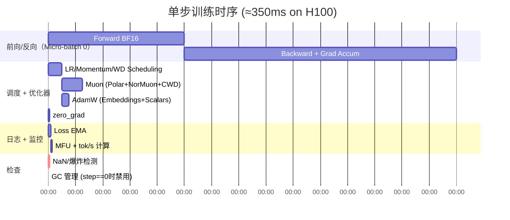
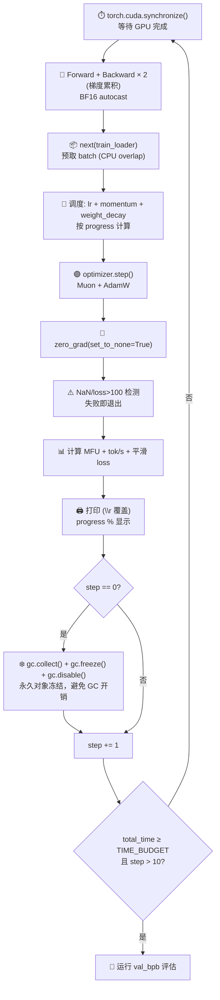

# train.py 详解（三）：训练循环与性能优化

> 本文档分析训练循环、超参数设置和性能优化技巧。

---

## 一、超参数配置

```python
# ===== 模型架构 =====
ASPECT_RATIO = 64          # model_dim = depth * ASPECT_RATIO
HEAD_DIM = 128             # 每个注意力头的维度 (FlashAttn 高效尺寸)
WINDOW_PATTERN = "SSSL"    # 3层滑动窗口 + 1层全注意力

# ===== 优化 =====
TOTAL_BATCH_SIZE = 2**19   # ≈ 524,288 tokens / optimizer step
EMBEDDING_LR = 0.6         # 词嵌入 LR (AdamW)
UNEMBEDDING_LR = 0.004     # LM head LR (AdamW)
MATRIX_LR = 0.04           # 矩阵参数 LR (Muon)
SCALAR_LR = 0.5            # 标量参数 LR (x0_lambdas)
WEIGHT_DECAY = 0.2         # Muon 的 Cautious WD
ADAM_BETAS = (0.8, 0.95)   # AdamW beta1, beta2

# ===== 调度 =====
WARMUP_RATIO = 0.0         # 无 warmup
WARMDOWN_RATIO = 0.5       # 后半段线性冷却
FINAL_LR_FRAC = 0.0        # 冷却到 0

# ===== 运行时 =====
DEPTH = 8                   # Transformer 层数
DEVICE_BATCH_SIZE = 128     # 每个 micro-batch 的序列数
```

### 梯度累积步数

```python
tokens_per_fwdbwd = DEVICE_BATCH_SIZE * MAX_SEQ_LEN  # 128 * 2048 = 262,144
grad_accum_steps = TOTAL_BATCH_SIZE // tokens_per_fwdbwd  # 524288 // 262144 = 2
```

**即**：每 2 个 micro-batch 做一次 optimizer step。

- Micro-batch: 128 × 2048 = 262K tokens
- Optimizer batch: 2 × 262K = 524K tokens
- 选择较小的 DEVICE_BATCH_SIZE + 梯度累积，避免单次 forward 占用过多显存

---

### 1.1 训练单步时序流（一个 optimizer step）



---

## 二、模型初始化流程

```python
# ===== Step 1: 确定设备 =====
device = torch.device("cuda")
H100_BF16_PEAK_FLOPS = 989.5e12  # 用于 MFU 计算

# ===== Step 2: 加载 tokenizer =====
tokenizer = Tokenizer.from_directory()
vocab_size = tokenizer.get_vocab_size()

# ===== Step 3: 构建模型配置 =====
config = build_model_config(DEPTH)
# 对于 DEPTH=8: n_layer=8, n_embd=512, n_head=4

# ===== Step 4: 初始化模型（meta device 避免浪费显存）=====
with torch.device("meta"):
    model = GPT(config)          # 不分配实际显存
model.to_empty(device=device)    # 现在真正分配显存
model.init_weights()             # 应用精心设计的初始化

# ===== Step 5: 设置优化器 =====
optimizer = model.setup_optimizer(
    unembedding_lr=UNEMBEDDING_LR,
    embedding_lr=EMBEDDING_LR,
    scalar_lr=SCALAR_LR,
    adam_betas=ADAM_BETAS,
    matrix_lr=MATRIX_LR,
    weight_decay=WEIGHT_DECAY,
)
# 设置 initial_lr（调度时会乘以 multiplier）
for group in optimizer.param_groups:
    group["initial_lr"] = group["lr"]

# ===== Step 6: 编译模型（全图编译）=====
model = torch.compile(model, dynamic=False)

# ===== Step 7: 预取第一个 batch =====
train_loader = make_dataloader(tokenizer, DEVICE_BATCH_SIZE, MAX_SEQ_LEN, "train")
x, y, epoch = next(train_loader)  # 第一个 batch 已在 GPU 上
```

### 关键优化点

1. **meta device 初始化**：先在 meta device 创建模型（不分配显存），再转移到 CUDA，避免"先分配大 tensor 再释放"带来的内存碎片

2. **torch.compile(dynamic=False)**：禁用动态形状，假设所有 batch 形状相同（确实如此：B=128, T=2048）。这使编译器可以做更激进的优化。

3. **预取 batch**：在训练循环开始前就取第一个 batch，减少循环启动延迟

---

## 三、学习率与动量调度

### 3.1 LR 乘数（随训练进度变化）

#### 3.1.1 两阶段调度：恒定 → 线性冷却

```mermaid
graph TD
    subgraph 训练时间轴 [0% → 100% (5 分钟 = 300 秒)]
        A["0% → 50%<br/>(0 ~ 150 秒)<br/>lr_mult = 1.0<br/>恒定学习率<br/>(快速收敛阶段)"]
        B["50% → 100%<br/>(150 ~ 300 秒)<br/>lr_mult = 1.0 → 0<br/>线性冷却<br/>(平滑收敛到 0)"]
        A --> B
    end

    style A fill:#bfdbfe
    style B fill:#fde68a
```

```python
def get_lr_multiplier(progress):
    """progress = 已训练时间 / TIME_BUDGET (0.0 ~ 1.0)"""
    if progress < WARMUP_RATIO:
        # WARMUP_RATIO = 0.0 → 无 warmup
        return progress / WARMUP_RATIO
    elif progress < 1.0 - WARMDOWN_RATIO:
        # 前 50% 时间: 恒定 LR
        return 1.0
    else:
        # 后 50% 时间: 线性冷却到 0
        cooldown = (1.0 - progress) / WARMDOWN_RATIO
        return cooldown * 1.0 + (1 - cooldown) * FINAL_LR_FRAC
```

### 3.2 Muon 动量调度

```python
def get_muon_momentum(step):
    """前 300 步从 0.85 线性增长到 0.95"""
    frac = min(step / 300, 1)
    return (1 - frac) * 0.85 + frac * 0.95
```

**直觉**：训练初期用较低的动量（更快响应梯度变化），后期提高动量（更平滑地收敛）。

### 3.3 Weight Decay 调度

```python
def get_weight_decay(progress):
    """WD 从 0.2 线性衰减到 0"""
    return WEIGHT_DECAY * (1 - progress)
```

**直觉**：训练初期需要较强的正则化（防止过拟合），后期减少正则化以允许参数自由微调。

---

## 四、训练循环详解

### 4.1 训练循环全景时序（单 step 内部结构）



```python
t_start_training = time.time()
smooth_train_loss = 0
total_training_time = 0
step = 0

while True:
    torch.cuda.synchronize()  # 等待 GPU 完成
    t0 = time.time()
    
    # ===== 前向/反向: 梯度累积 =====
    for micro_step in range(grad_accum_steps):  # 默认 2 次
        with autocast_ctx:  # bfloat16 自动混合精度
            loss = model(x, y)
        train_loss = loss.detach()
        loss = loss / grad_accum_steps    # 缩放 loss
        loss.backward()                    # 累积梯度
        x, y, epoch = next(train_loader)   # 预取下一个 batch
    
    # ===== 调度: 计算当前参数 =====
    progress = min(total_training_time / TIME_BUDGET, 1.0)
    lrm = get_lr_multiplier(progress)
    muon_momentum = get_muon_momentum(step)
    muon_weight_decay = get_weight_decay(progress)
    
    # 应用到 optimizer groups
    for group in optimizer.param_groups:
        group["lr"] = group["initial_lr"] * lrm
        if group['kind'] == 'muon':
            group["momentum"] = muon_momentum
            group["weight_decay"] = muon_weight_decay
    
    # ===== 优化器 step + 清空梯度 =====
    optimizer.step()
    model.zero_grad(set_to_none=True)  # 设为 None 比设为 0 更快
    
    # ===== 快速失败检测 =====
    train_loss_f = train_loss.item()
    if math.isnan(train_loss_f) or train_loss_f > 100:
        print("FAIL")
        exit(1)  # NaN 或 loss 爆炸 → 立即终止
    
    # ===== 计时（跳过前 10 步的编译时间）=====
    torch.cuda.synchronize()
    t1 = time.time()
    dt = t1 - t0
    if step > 10:
        total_training_time += dt
    
    # ===== 日志: EMA loss + MFU =====
    ema_beta = 0.9
    smooth_train_loss = ema_beta * smooth_train_loss + (1 - ema_beta) * train_loss_f
    debiased_smooth_loss = smooth_train_loss / (1 - ema_beta**(step + 1))
    
    pct_done = 100 * progress
    tok_per_sec = int(TOTAL_BATCH_SIZE / dt)
    mfu = 100 * num_flops_per_token * TOTAL_BATCH_SIZE / dt / H100_BF16_PEAK_FLOPS
    
    print(f"\rstep {step:05d} ({pct_done:.1f}%) | "
          f"loss: {debiased_smooth_loss:.6f} | "
          f"lrm: {lrm:.2f} | "
          f"dt: {dt*1000:.0f}ms | "
          f"tok/sec: {tok_per_sec:,} | "
          f"mfu: {mfu:.1f}% | "
          f"epoch: {epoch} | "
          f"remaining: {max(0, TIME_BUDGET - total_training_time):.0f}s    ",
          end="", flush=True)
    
    # ===== GC 管理: 第 1 步冻结并禁用 Python GC =====
    if step == 0:
        gc.collect()    # 清理当前垃圾
        gc.freeze()     # 将现有对象标记为"永久", GC 以后跳过它们
        gc.disable()    # 完全禁用自动 GC
    elif (step + 1) % 5000 == 0:
        gc.collect()    # 每 5000 步手动清理一次
    
    step += 1
    
    # ===== 时间到退出 =====
    if step > 10 and total_training_time >= TIME_BUDGET:
        break
```

---

## 五、关键性能优化详解

### 5.1 torch.cuda.synchronize()

在循环开始和结束处同步 GPU。这确保：
- `dt` 测量的是**实际 GPU 计算时间**（而不是 kernel launch 时间）
- 不会有"CPU 跑在 GPU 前面"导致的计时不准

### 5.2 跳过前 10 步计时

```python
if step > 10:
    total_training_time += dt
```

**原因**：torch.compile 的前几步是编译时间（可能几秒到几十秒），不计入有效训练时间。这意味着实际训练时间略长于 5 分钟，但"有效训练步数"恰好是在 5 分钟内完成的。

### 5.3 Python GC 管理

这是一个非常精妙但少有人用的技巧：

```python
if step == 0:
    gc.collect()    # 强制 GC 一次，清理启动时的临时对象
    gc.freeze()     # 将所有当前存活对象标记为"永久"
    gc.disable()    # 禁用自动 GC
elif (step + 1) % 5000 == 0:
    gc.collect()    # 每 5000 步手动清理一次
```

**为什么这样做？**

- Python 的自动 GC 每几百次分配就会运行一次扫描，每次扫描造成 10-100ms 的停顿（取决于对象数量）
- `gc.freeze()` 将训练循环开始前的所有对象标记为"永久"，GC 扫描时跳过它们 → 扫描更快
- `gc.disable()` 完全禁用自动 GC，消除所有停顿
- 手动每隔 5000 步清理一次（只需几毫秒），处理循环中产生的少量临时对象

**效果**：消除训练日志中的"抖动"，提高平均 tok/sec。

### 5.4 autocast + bfloat16

```python
autocast_ctx = torch.amp.autocast(device_type="cuda", dtype=torch.bfloat16)
with autocast_ctx:
    loss = model(x, y)
```

bfloat16 的优势：
- 相比 fp32，显存减半，计算吞吐量翻倍（Tensor Core）
- 相比 fp16，不需要 loss scaling（动态范围更大）
- 是 H100 等现代 GPU 的原生精度

### 5.5 zero_grad(set_to_none=True)

```python
model.zero_grad(set_to_none=True)  # 而不是 model.zero_grad()
```

`set_to_none=True` 将 `.grad` 设置为 `None` 而不是 `torch.zeros_like(...)`，节省内存（不需要全零 tensor）并让 autograd 可以用 in-place 操作，更快。

### 5.6 EMA Loss（去偏差）

```python
smooth_train_loss = ema_beta * smooth_train_loss + (1 - ema_beta) * train_loss_f
debiased_smooth_loss = smooth_train_loss / (1 - ema_beta**(step + 1))
```

**为什么要去偏差？** EMA 在早期有偏差（初始 `smooth_train_loss = 0`）。除以 `1 - β^(t+1)` 抵消初始偏差，使显示的 loss 在早期也是无偏估计。

---

## 六、最终评估与报告

```python
print()  # 换行，结束 \r 日志

# ===== 最终验证集评估 =====
model.eval()
with autocast_ctx:
    val_bpb = evaluate_bpb(model, tokenizer, DEVICE_BATCH_SIZE)

# ===== 汇总报告 =====
t_end = time.time()
peak_vram_mb = torch.cuda.max_memory_allocated() / 1024 / 1024
total_tokens = step * TOTAL_BATCH_SIZE

print("---")
print(f"val_bpb:          {val_bpb:.6f}")
print(f"training_seconds: {total_training_time:.1f}")
print(f"total_seconds:    {t_end - t_start:.1f}")
print(f"peak_vram_mb:     {peak_vram_mb:.1f}")
print(f"mfu_percent:      {steady_state_mfu:.2f}")
print(f"total_tokens_M:   {total_tokens / 1e6:.1f}")
print(f"num_steps:        {step}")
print(f"num_params_M:     {num_params / 1e6:.1f}")
print(f"depth:            {DEPTH}")
```

### 输出字段说明

| 字段 | 含义 | 典型值 (H100, DEPTH=8) |
|-----|------|------------------------|
| val_bpb | 验证集 bits per byte（越低越好） | 0.5 - 1.5 |
| training_seconds | 实际训练秒数（跳过编译） | ≈ 300 |
| total_seconds | 总墙钟时间（含编译/评估） | 320 - 350 |
| peak_vram_mb | 峰值显存使用 | ~45,000 (45 GB) |
| mfu_percent | 稳态 MFU | ~40% |
| total_tokens_M | 训练总 token 数 (M) | ~500 |
| num_steps | 总优化步数 | ~950 |
| num_params_M | 参数数量 (M) | ~50 |
| depth | 层数 | 8 |

---

## 七、训练循环性能优化要点总结

| 优化手段 | 文件位置 | 技术意义 | 预期收益 |
|---------|---------|---------|---------|
| `torch.cuda.synchronize()` | 循环开始/结束 | 准确测量 GPU 时间 | 日志准确 |
| 跳过前 10 步计时 | 循环末尾 | 排除 torch.compile 开销 | 不惩罚编译 |
| `gc.freeze() + gc.disable()` | step 0 | 消除 Python GC 停顿 | ~5-10% 速度提升 |
| `autocast(bfloat16)` | forward pass | 自动混合精度，Tensor Core 加速 | ~2× 吞吐 |
| `zero_grad(set_to_none=True)` | step 后 | 节省内存 + 更快 autograd | ~5% 速度提升 |
| `torch.compile(dynamic=False)` | 模型编译 | 算子融合 + kernel 优化 | ~1.5-2× 速度提升 |
| EMA + debiased loss | 日志 | 平滑 loss 曲线 | 可读性 |
| 梯度累积 | micro-step 循环 | 在有限显存下实现大 batch | 灵活性 |
| 快速失败检测 | loss 检查 | 及时终止发散的训练 | 节省时间 |
| bfloat16 嵌入存储 | init_weights | 减少 embedding 显存占用 | ~500 MB |

---

## 八、MFU 计算

```
MFU = 实际计算吞吐量 / 峰值计算吞吐量

实际 = FLOPs_per_token × TOTAL_BATCH_SIZE / step_time
峰值 = H100 BF16 峰值 = 989.5 TFLOPs/s = 989.5 × 10^12 FLOPs/s
```

**典型值**：
- FLOPs_per_token ≈ 3-5 × 10^8（取决于模型大小）
- TOTAL_BATCH_SIZE = 524,288
- step_time ≈ 300-350 ms
- MFU ≈ 40%

MFU 40% 对于一个单文件、未做极致优化的实现来说已经相当不错。生产级框架（如 Megatron-LM）可以达到 55-70% MFU，但需要大量工程投入（流水线并行、算子手工编写、通信优化等）。
