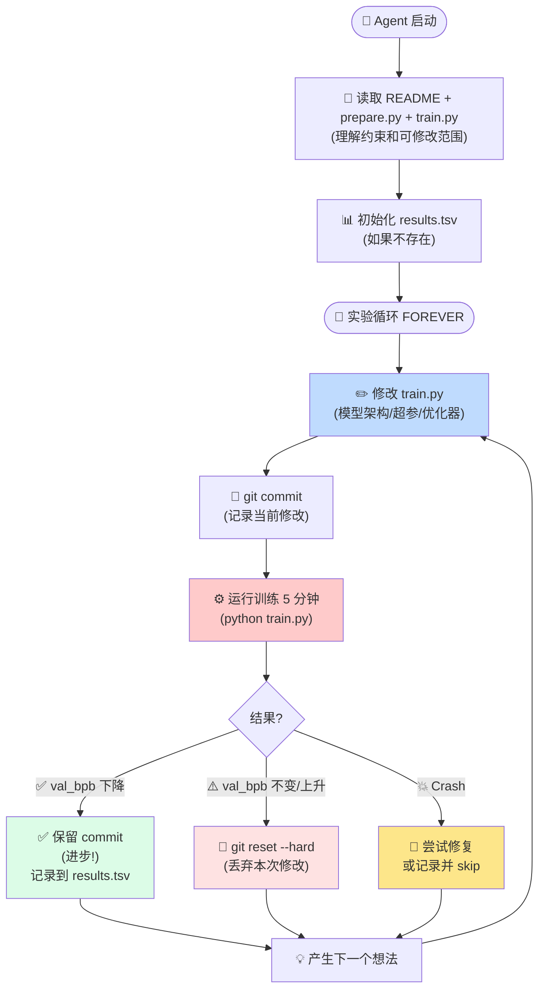

# program.md 详解：Agent 的实验指令手册

> program.md 是 AI Agent 的"实验规则书"。它定义了：
> 1. 如何设置实验
> 2. 修改什么 / 不修改什么
> 3. 如何评估和记录结果
> 4. 保留/丢弃的决策逻辑

---

## 一、总体流程

### 1.1 Agent 自主实验循环流程图



```
人类确认分支 → Agent 读取 README + prepare.py + train.py
    ↓
初始化 results.tsv (记录所有实验)
    ↓
循环 FOREVER:
    修改 train.py → git commit → 训练 5 分钟 → 读取 val_bpb
        ↓
    val_bpb 下降? → 保留 commit (进步!)
    val_bpb 不变/上升? → git reset (丢弃)
    crash? → 尝试修复或记录并跳过
    ↓
记录到 results.tsv
    ↓
继续下一个想法...
```

---

## 二、设置阶段（Setup）

### 2.1 分支管理

```
1. 确定 run tag (e.g. "mar5")
2. 创建分支 autoresearch/<tag>
3. 这是 Agent 的"独立实验空间"
```

**设计目的**：每个独立的实验运行有独立分支，方便人类事后审查。

### 2.2 关键文件读取

Agent 必须先读取并理解：
- **README.md** — 项目高层设计
- **prepare.py** — 固定基础设施（数据、评估）
- **train.py** — 可修改的目标文件

### 2.3 验证数据

检查 `~/.cache/autoresearch/` 存在（含 parquet shards + tokenizer）。不存在则要求人类先运行 `prepare.py`。

### 2.4 初始化结果表

创建 `results.tsv`（tab 分隔）：

```
commit    val_bpb    memory_gb    status    description
```

---

## 三、修改范围的约束（什么能改 / 不能改）

### ✅ Agent 可以修改：`train.py`

| 可修改项 | 示例 |
|---------|------|
| 模型架构 | 层数、维度、注意力机制、MLP 激活、是否用 x0 shortcut 等 |
| 超参数 | 学习率、批大小、weight decay、调度策略 |
| 优化器 | Muon 参数、分组策略、调度曲线 |
| 训练循环 | 是否 warmup、冷却比例、快速失败阈值 |

### ❌ Agent 不可以修改

| 禁止项 | 原因 |
|-------|------|
| `prepare.py` | 评估和数据加载必须固定，否则指标不可比 |
| `pyproject.toml` / 依赖 | 不能安装新包，限制在现有工具 |
| evaluation harness | val_bpb 计算必须保持不变 |

---

## 四、实验循环详解

### 4.1 单次实验流程

```
1. 看 git 状态（当前 commit / 分支）
2. 用一个实验想法修改 train.py
   - 例子: "将 MLP 从 ReLU² 改为 GELU"
   - 例子: "将 LR 从 0.04 提高到 0.06"
   - 例子: "在注意力中加入 Grouped Query Attention"
3. git commit -m "描述这次修改"
4. 运行: uv run train.py > run.log 2>&1
   - 重定向所有输出到日志文件
   - 不要让输出污染 Agent 的上下文（节省 token）
5. 从日志提取关键结果:
   grep "^val_bpb:\|^peak_vram_mb:" run.log
6. 如果 grep 无输出 → 运行崩溃了
   - 查看 tail -n 50 run.log 的错误堆栈
   - 如果是简单错误（拼写、缺少 import）→ 修复并重试
   - 如果想法本身不可行（OOM、shape 错）→ 记录并跳过
7. 记录到 results.tsv
8. 决策:
   - val_bpb 降低 → 保留 commit（"advance the branch"）
   - val_bpb 升高或不变 → git reset --hard（丢弃这次修改）
```

### 4.2 结果记录格式

**results.tsv 的列**（tab 分隔，不是逗号）：

| 列 | 含义 | 示例 |
|----|------|------|
| commit | 短 commit hash (7 chars) | a1b2c3d |
| val_bpb | 验证集 BPB | 0.997900 |
| memory_gb | 峰值显存 (GB) | 44.0 |
| status | keep / discard / crash | keep |
| description | 一句话描述实验 | baseline |

**示例**：

```
commit    val_bpb    memory_gb    status    description
a1b2c3d   0.997900   44.0         keep      baseline
b2c3d4e   0.993200   44.2         keep      increase LR to 0.04
c3d4e5f   1.005000   44.0         discard   switch to GELU activation
d4e5f6g   0.000000   0.0          crash     double model width (OOM)
```

**注意**：results.tsv **不提交**到 git（留给人类分析，不污染 git 历史）。

### 4.3 保留/丢弃决策

| 情况 | 操作 | 说明 |
|-----|------|------|
| val_bpb 明显下降（< baseline） | ✅ Keep | 保留 commit，新的 baseline |
| val_bpb 小幅上升或不变 | ❌ Discard | git reset，回到之前最好的 |
| 运行崩溃 | ⚠️ Crash → 记录 | val_bpb=0.0, memory_gb=0.0 |

**关键思想**：这是一个贪心搜索。Agent 总是从当前最好的 commit 出发尝试新修改，保留改善，丢弃恶化。

---

## 五、约束与偏好

### 5.1 VRAM 约束

- VRAM 是"软约束"
- 可以轻微增加 VRAM 换取显著的 val_bpb 提升
- 不能爆炸式增长（例如 2× 显存）
- OOM 算作 crash

### 5.2 简洁性标准（Simplicity Criterion）

> 同等 val_bpb 下，更简单的代码更好

- 20 行 hack 换来 0.001 val_bpb 改进 → **不值得**
- 删除代码换来同等或更好结果 → **非常值得**
- ~0 改进但代码大幅简化 → **保留**

**这防止了"过拟合实验设计"** — Agent 不会为了微小改进而堆积复杂技巧。

---

## 六、永不停止

```python
while True:  # FOREVER
    ...
```

- 一旦启动，Agent 持续运行直到被人类手动中断
- 如果用户离开电脑，Agent 应该继续实验
- 人类醒来后查看 results.tsv 和 git log 即可

**预期吞吐量**：
- 每次实验 ≈ 5 分钟 + 几秒 overhead
- ≈ 12 次实验 / 小时
- ≈ 100 次实验 / 8 小时睡眠

---

## 七、Agent 的"研究方法论"

### 7.1 搜索空间

Agent 可以探索的方向：
1. **超参数搜索**：LR、batch size、WD、调度
2. **架构搜索**：深度、宽度、head 数量、窗口模式
3. **组件替换**：MLP 激活、归一化方式、RoPE base
4. **优化策略**：Muon 参数、分组、LR 调度
5. **组合改进**：将之前多个成功的 idea 组合

### 7.2 隐式策略

虽然 program.md 没有硬性规定，但一个好的 Agent 会：
- **从 baseline 开始**：第一次跑默认配置
- **逐步探索**：一次只改一个变量（科学方法）
- **组合成功的修改**：在多个小改进上累加
- **重读代码**：当卡住时重新阅读源代码寻找新灵感

### 7.3 超时保护

```
- 每次实验预期 ~5 分钟
- 如果 > 10 分钟仍未完成 → 杀死进程
- 记录为 crash 或 discard
```

防止无限循环或内存泄漏导致的挂起。

---

## 八、设计理念总结

### 8.1 为什么这样设计？

| 设计 | 目的 |
|-----|------|
| 固定 5 分钟时间预算 | 实验公平可比，快速迭代 |
| 只改 train.py | 限制范围，diff 可读，评估固定 |
| 贪心保留/丢弃 | 简单有效策略，确保 monotonic improvement |
| 永不停止 | 最大化人类不在电脑前时的探索 |
| val_bpb 单一指标 | 决策简单明确，无多目标权衡 |
| results.tsv 外部记录 | 保留完整实验历史，不污染 git |

### 8.2 这是什么类型的搜索？

从 ML 角度，这是一个：
- **黑盒优化**（修改代码 → 得到一个标量指标 val_bpb）
- **贪心爬山**（每次从当前最佳点出发，只保留改善）
- **离散搜索**（代码修改是离散的，不是连续梯度空间）
- **LLM 驱动的搜索**（搜索方向由 Agent 的代码理解能力决定）

### 8.3 与传统 AutoML 的区别

| 维度 | 传统 AutoML | autoresearch |
|-----|------------|-------------|
| 搜索空间 | 预定义的超参网格 | 任意代码修改 |
| 搜索算子 | 随机/贝叶斯采样 | LLM 生成的代码编辑 |
| 可解释性 | 低（黑盒） | 高（每个 commit 有明确描述）|
| 计算开销 | 高（通常需要大量并行）| 低（单 GPU 串行）|
| 创造性 | 低（只搜索预定义选项） | 高（可以发明新技巧） |
