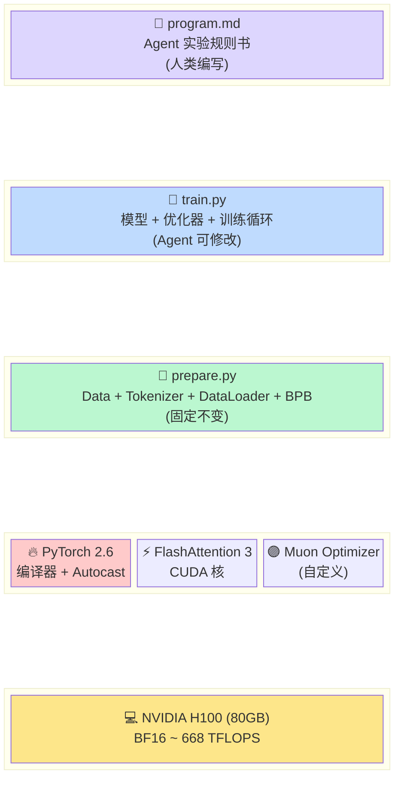

# autoresearch 项目全景分析

> 本文档提供项目的全局视图：设计哲学、技术架构、关键创新和未来方向。

---

## 一、项目定位

**autoresearch = Andrej Karpathy 的 "LLM 做自己的研究" 实验**

核心思想：给一个 LLM Agent 一套完整的训练基础设施，让它自主地修改模型代码、运行实验、评估结果、保留/丢弃修改，并持续迭代。

```
传统研究: 人类研究员 → 改代码 → 跑实验 → 看结果 → 改代码 ...
autoresearch: AI Agent → 改代码 → 跑实验 → 看结果 → 改代码 ...
```

**目标**：在单张 H100 上 24/7 运行，人类只需要偶尔检查 results.tsv。

---

## 二、项目文件架构

```
workspace/
├── README.md           # 项目介绍 + 快速上手
├── program.md          # Agent 的实验规则书（人类编辑）
├── prepare.py          # 数据 + tokenizer + dataloader + evaluation（固定）
├── train.py            # 模型 + 优化器 + 训练循环（Agent 编辑）
├── pyproject.toml      # 依赖配置
├── analysis.ipynb      # 分析笔记本
└── progress.png        # 示意图

运行时产物 (~/.cache/autoresearch/):
├── data/               # Parquet shards (训练/验证数据)
└── tokenizer/
    ├── tokenizer.pkl   # 训练好的 BPE tokenizer (tiktoken 格式)
    └── token_bytes.pt  # token → 字节长度映射 (用于 BPB)

实验产物:
├── run.log             # 单次训练日志
└── results.tsv         # 实验历史记录表 (git 不跟踪)
```

---

## 三、关键技术栈

### 3.1 技术栈分层图



```
┌────────────────────────────────────────────────────────────────┐
│  应用层                                                        │
│  ┌─────────────────────────────────────────────────────┐       │
│  │  program.md  (Agent 指令 + 实验方法论)              │       │
│  └─────────────────────────────────────────────────────┘       │
│                                                                │
├────────────────────────────────────────────────────────────────┤
│  训练代码 (Agent 可修改)                                        │
│  ┌─────────────────────────────────────────────────────┐       │
│  │  train.py                                           │       │
│  │  ├── GPT 模型 (RoPE, FlashAttn3, ResFormer, x0)     │       │
│  │  ├── Muon + AdamW 混合优化器                        │       │
│  │  ├── 梯度累积训练循环                               │       │
│  │  └── 超参数配置 (LR, WD, batch size, etc)           │       │
│  └─────────────────────────────────────────────────────┘       │
│                                                                │
├────────────────────────────────────────────────────────────────┤
│  基础设施 (固定不变)                                            │
│  ┌─────────────────────────────────────────────────────┐       │
│  │  prepare.py                                         │       │
│  │  ├── 数据下载 (Parquet shards from HuggingFace)    │       │
│  │  ├── BPE Tokenizer 训练 (rustbpe → tiktoken)        │       │
│  │  ├── BOS-aligned Best-Fit DataLoader               │       │
│  │  └── BPB Evaluation (vocab-size-independent metric)│       │
│  └─────────────────────────────────────────────────────┘       │
│                                                                │
├────────────────────────────────────────────────────────────────┤
│  框架与硬件                                                     │
│  ┌─────────────────────────────────────────────────────┐       │
│  │  PyTorch 2.9.1 + CUDA                              │       │
│  │  torch.compile (fullgraph, dynamic=False)          │       │
│  │  kernels (Flash Attention 3, Hopper-optimized)     │       │
│  │  bfloat16 AMP                                       │       │
│  │  NVIDIA H100 (推荐)                                 │       │
│  └─────────────────────────────────────────────────────┘       │
│                                                                │
└────────────────────────────────────────────────────────────────┘
```

---

## 四、GPT 模型架构（默认 DEPTH=8）

```
输入: idx [B=128, T=2048]
    │
    ▼
Token Embedding [B, T, 512] + RMSNorm
    │  (保存 x0 用于 x0 shortcut)
    ▼
    ┌────────────────────────────────────────────────────┐
    │  Transformer Block × 8                             │
    │  ┌──────────────────────────────────────────┐     │
    │  │  x0 shortcut (可学习标量融合)            │     │
    │  │  x = λ_resid * x + λ_x0 * x0            │     │
    │  └──────────────────────────────────────────┘     │
    │  ┌──────────────────────────────────────────┐     │
    │  │  Attention (Pre-LN)                      │     │
    │  │  ├── RMSNorm(x)                          │     │
    │  │  ├── Q, K, V 投影 (无 bias)              │     │
    │  │  ├── ResFormer Value Embedding (交替层)  │     │
    │  │  │   ve = Embedding(idx)                 │     │
    │  │  │   gate = sigmoid(Linear(x[:32])) * 2  │     │
    │  │  │   v = v + gate * ve                   │     │
    │  │  ├── RoPE on Q, K                        │     │
    │  │  ├── RMSNorm on Q, K                     │     │
    │  │  ├── Flash Attention 3 (滑动窗口/全)      │     │
    │  │  └── 线性投影 (zero-init)                │     │
    │  └──────────────────────────────────────────┘     │
    │  ┌──────────────────────────────────────────┐     │
    │  │  MLP (Pre-LN)                            │     │
    │  │  ├── RMSNorm(x)                          │     │
    │  │  ├── Linear(512 → 2048)                  │     │
    │  │  ├── ReLU(x)²                            │     │
    │  │  └── Linear(2048 → 512, zero-init)       │     │
    │  └──────────────────────────────────────────┘     │
    └────────────────────────────────────────────────────┘
    │
    ▼
Final RMSNorm
    │
    ▼
LM Head (Linear 512 → vocab_size, bias=False)
    │
    ▼
Logit Softcap: 15 * tanh(logits / 15)
    │
    ▼
Cross Entropy Loss (reduction=mean 或 none)
```

---

## 五、优化器架构（Muon + AdamW）

```
参数按类型分组:
┌────────────────────────────────────────────────────┐
│  LM Head (2D matrix)                               │
│  └─ AdamW, lr=0.004, betas=(0.8, 0.95), eps=1e-10 │
├────────────────────────────────────────────────────┤
│  Token Embedding (2D matrix)                       │
│  └─ AdamW, lr=0.6, betas=(0.8, 0.95), eps=1e-10   │
├────────────────────────────────────────────────────┤
│  Value Embeddings (多个 2D matrix)                 │
│  └─ AdamW, lr=0.6, betas=(0.8, 0.95), eps=1e-10   │
├────────────────────────────────────────────────────┤
│  resid_lambdas (1D vector)                         │
│  └─ AdamW, lr=0.05, betas=(0.8, 0.95)              │
├────────────────────────────────────────────────────┤
│  x0_lambdas (1D vector)                            │
│  └─ AdamW, lr=0.5, betas=(0.96, 0.95)              │
├────────────────────────────────────────────────────┤
│  Transformer 矩阵 (按形状分组, 多个 2D matrix)    │
│  └─ Muon                                           │
│     ├── lr: 0.04 × sqrt(max(D_out, D_in)/min(...))│
│     ├── momentum: 0.85 → 0.95 (300 步线性增长)     │
│     ├── ns_steps: 5 (Polar Express 迭代次数)        │
│     ├── beta2: 0.95 (NorMuon 二阶矩)               │
│     ├── weight_decay: 0.2 → 0 (线性衰减到 0)        │
│     ├── Polar Express 正交化 (Newton-Schulz)        │
│     ├── NorMuon 方差减少 (按 reduced dim 归一化)    │
│     └── Cautious Weight Decay (只衰减正增长参数)    │
└────────────────────────────────────────────────────┘

全局调度:
- 前 50% 时间: LR 恒定 (无 warmup)
- 后 50% 时间: LR 线性冷却到 0
- Muon WD: 线性从 0.2 衰减到 0
- Muon momentum: 300 步内从 0.85 到 0.95
```

---

## 六、DataLoader 架构

```
┌────────────────────────────────────────────────────────────┐
│  BOS-Aligned Best-Fit Packing DataLoader                  │
│                                                            │
│  输入: ~/.cache/autoresearch/data/shard_*.parquet          │
│  输出: (inputs [B=128, T=2048], targets [B=128, T=2048])  │
│                                                            │
│  流程:                                                     │
│  ┌────────────────────────────────────────────────────┐   │
│  │ 1. 流式读取 parquet 文档 (按 shard 顺序)           │   │
│  │    doc_1, doc_2, doc_3, ...                        │   │
│  └────────────────────────────────────────────────────┘   │
│  ┌────────────────────────────────────────────────────┐   │
│  │ 2. BPE tokenize + prepend BOS token                │   │
│  │    [BOS, tokens_from_doc...]                        │   │
│  └────────────────────────────────────────────────────┘   │
│  ┌────────────────────────────────────────────────────┐   │
│  │ 3. Best-Fit 打包到 128×2049 buffer                 │   │
│  │    - 对每一行:                                      │   │
│  │      - 找最大的能完全放入剩余空间的文档             │   │
│  │      - 如果没有能放下的 → 截断最短文档填满           │   │
│  │    - 结果: 每一行 = [BOS, doc1_tokens, BOS, doc2..]│   │
│  │    - 特性: 100% 利用率, 无 padding                  │   │
│  └────────────────────────────────────────────────────┘   │
│  ┌────────────────────────────────────────────────────┐   │
│  │ 4. 拆分 inputs / targets                           │   │
│  │    inputs = buffer[:, :-1]   (0..T-1)              │   │
│  │    targets = buffer[:, 1:]    (1..T)               │   │
│  └────────────────────────────────────────────────────┘   │
│  ┌────────────────────────────────────────────────────┐   │
│  │ 5. 异步 GPU 传输 (pin_memory + non_blocking)       │   │
│  └────────────────────────────────────────────────────┘   │
│                                                            │
│  评估时:                                                    │
│    - 从 val shard 读取                                      │
│    - EVAL_TOKENS = 40 × 524,288 ≈ 21M tokens               │
│    - 计算 per-token loss * byte_length / log(2)            │
└────────────────────────────────────────────────────────────┘
```

---

## 七、训练循环时序

```
Wall clock timeline (一次 step ≈ 300-350ms on H100):

t0 ──┬── GPU sync ───────────────────────────────────►
     │
     ├── [micro-step 0]
     │   ├── autocast forward pass ───────────────► 100ms
     │   ├── loss scaling (div by grad_accum)
     │   ├── backward pass ───────────────────────► 200ms
     │   └── next batch prefetch
     │
     ├── [micro-step 1] (if grad_accum=2)
     │   ├── forward + backward (同上)
     │   └── next batch prefetch
     │
     ├── LR/momentum/WD scheduling (Python)
     ├── optimizer.step() (Muon + AdamW) ───────► 20ms
     ├── zero_grad(set_to_none=True)
     │
     ├── 日志计算 + print (\r, flush=True)
     ├── GC 管理 (step==0 时 freeze+disable)
     │
t1 ──┴── GPU sync ───────────────────────────────────►
     dt ≈ 350ms per optimizer step

总训练:
- 前 10 步: 含 torch.compile 开销 (几秒到几十秒, 不计入)
- 之后: 稳定 ~350ms/step
- 有效训练: 300s / 0.35s ≈ 857 steps
- 总 tokens: ~857 × 524K ≈ 450M tokens
```

---

## 八、BPB 评估指标

```
Bits Per Byte (BPB):
┌──────────────────────────────────────────────────────────────┐
│  计算:                                                       │
│  BPB = Σ(loss_i × bytes_i) / (log(2) × Σ bytes_i)           │
│                                                              │
│  其中:                                                        │
│    loss_i  = cross_entropy 损失 (nats, 即无 log)             │
│    bytes_i = token i 的 UTF-8 编码字节数                     │
│              (预计算在 token_bytes.pt 中)                     │
│    log(2)  ≈ 0.693 (nats → bits 转换系数)                    │
│                                                              │
│  排除:                                                        │
│    - 特殊 token (bytes_i = 0, mask 全过滤)                   │
│                                                              │
│  直觉: "平均每个原始字节需要多少比特来编码"                    │
│  - 完美压缩: 0 bits/byte (不可能)                            │
│  - 随机字节: 8 bits/byte (最差)                              │
│  - 好的 LLM: 0.5-1.5 bits/byte                               │
│                                                              │
│  与 Perplexity 的区别:                                        │
│    Perplexity = exp(loss) — 依赖 vocab size, 依赖 tokenizer │
│    BPB = loss × (avg_bytes_per_token / log(2))              │
│        — 与 vocab size 无关                                  │
│        — 与 tokenizer 无关                                   │
│        → 跨模型可比!                                         │
└──────────────────────────────────────────────────────────────┘
```

---

## 九、关键创新点速查表

| # | 创新 | 位置 | 意义 |
|---|------|------|------|
| 1 | 自主实验循环 | program.md | 把研究过程自动化 |
| 2 | 固定时间预算 | prepare.py:31 | 实验公平可比 |
| 3 | BPB 评估 | prepare.py:343-365 | 与 tokenizer 无关的指标 |
| 4 | Best-Fit 打包 | prepare.py:276-337 | 100% 序列利用率 |
| 5 | ResFormer VE | train.py:84-87 | 改善注意力信息流动 |
| 6 | x0 Shortcut | train.py:276-277 | 深层直接访问原始嵌入 |
| 7 | Q/K RMSNorm | train.py:91 | 注意力输入归一化 |
| 8 | Sliding Window | train.py:195-206 | 效率/上下文平衡 |
| 9 | Logit Softcap | train.py:283-285 | 稳定训练 |
| 10 | Muon 优化器 | train.py:297-353 | 矩阵正交化优化 |
| 11 | Cautious WD | train.py:352 | 智能 L2 正则化 |
| 12 | 按形状分组 | train.py:257-262 | Muon 批量处理 |
| 13 | 0-dim 参数张量 | train.py:362-371 | 避免重新编译 |
| 14 | GC Freeze | train.py:593-598 | 消除 Python GC 抖动 |
| 15 | torch.compile | train.py:508 | 全图算子融合 |
| 16 | bf16 AMP | train.py:462 | 自动混合精度 |
| 17 | Zero-init 残差 | train.py:init_weights | 初始恒等映射 |
| 18 | 1/√d_model LR 缩放 | train.py:248 | 模型大小自动校准 |
| 19 | 贪婪保留策略 | program.md | 简单有效的搜索策略 |
| 20 | 外部结果记录 | results.tsv | 完整可追溯的实验日志 |

---

## 十、设计哲学总结

### 10.1 "少即是多"

- **单一文件修改**: Agent 只改 train.py → 简单、diff 可读
- **单一指标**: val_bpb → 决策简单明确
- **单 GPU**: 无分布式复杂度，任何人可以跑
- **固定时间**: 5 分钟一次实验，快速迭代

### 10.2 "Agent 是研究员，不是优化器"

- 不是贝叶斯优化或强化学习
- Agent 用"代码理解 + 领域知识"来提出修改
- 这是**人类设计的研究方法论 + AI 执行的搜索能力**的组合
- program.md = 研究方法论，Agent = 执行搜索

### 10.3 "人类仍在循环中"

- 人类设置 program.md（定义游戏规则）
- 人类事后审查 results.tsv 和 git history
- 人类决定何时停止、何时改变方向
- Agent 做的是：夜间、无人值守、大规模搜索

---

## 十一、默认配置下的规模估算

| 维度 | 默认值 | 备注 |
|-----|--------|------|
| 层数 | 8 | 可改 DEPTH |
| 模型维度 | 512 | depth × 64，对齐 128 |
| 注意力头数 | 4 | 512 // 128 |
| 序列长度 | 2048 | MAX_SEQ_LEN，不可改 |
| 词表大小 | ~8K | 由 tokenizer 决定 |
| 参数数量 | ~50M | 含 embeddings |
| Micro batch | 128 | DEVICE_BATCH_SIZE |
| Optimizer batch | 524K tokens | 2× micro batch |
| 每次实验步数 | ~950 | 5 分钟内 |
| 每步 FLOPs | ~2.6 × 10^11 | 估算 |
| MFU | ~40% | H100 |
| 峰值显存 | ~45 GB | H100 |

---

## 十二、从 0 到 1 的完整数据流程

### 12.1 全流程数据流图（数据 → tokenizer → training → metrics）

```mermaid
flowchart TB
    subgraph 准备阶段 [阶段 1: 一次性准备 (人类执行)]
        Raw["📜 FineWeb-Edu 10B chars<br/>(Parquet shards)"] -->
        RustBPE["🦀 rustbpe BPE 训练<br/>(合并规则)"] -->
        TikTok["🔤 tiktoken Encoding<br/>(Python 推理)"]
        TikTok --> Pkl["💾 tokenizer.pkl"]
        TikTok --> Bytes["📐 token_bytes.pt<br/>(vocab_size → 字节长度)"]
    end

    subgraph 训练循环 [阶段 2: Agent 训练循环]
        direction TB

        Pkl --> Encoder["🧠 encode_ordinary_batch<br/>(多线程 tokenize)"]
        Raw2["📦 Parquet shards<br/>(~/.cache/autoresearch/data)"] --> Encoder

        Encoder --> BestFit["📦 Best-Fit Packing<br/>(无 padding, 100% 利用率)"]
        BestFit --> DL["📊 DataLoader<br/>(shuffle × workers × prefetch)"]
        DL --> Tokens["🎯 (x, y) tokens<br/>(B=128, T=2048)"]

        Tokens --> Model["🧠 GPT-8 层模型<br/>(BF16 autocast)"]
        Model --> Loss["📉 Cross Entropy Loss"]
        Loss --> Backward["🔄 Backward + Grad Accum"]
        Backward --> Optimizer["🟣 Muon + AdamW"]
        Optimizer --> Updated["✅ 权重更新"]
        Updated --> Model
    end

    subgraph 评估 [阶段 3: BPB 指标评估]
        direction TB
        ValTokens["📐 验证集 tokens"] --> ValModel["🧠 模型推理 (eval mode)"]
        Bytes --> Lookup["🔍 token_bytes 查表<br/>(token → 字节数)"]
        ValModel --> ValLoss["📊 每个位置的 loss"]
        ValLoss --> BPB["📊 val_bpb = Σ(loss × bytes) / log(2)Σ(bytes)"]
        BPB --> Result["🏆 实验结果<br/>(越小越好)"]
        Lookup --> BPB
    end

    style Raw fill:#dbeafe
    style RustBPE fill:#fecaca
    style Pkl fill:#fde68a
    style Model fill:#bfdbfe
    style Optimizer fill:#ddd6fe
    style BPB fill:#dcfce7
    style Result fill:#bbf7d0
```

```
┌──────────────────────────────────────────────────────────────┐
│  准备阶段 (人类执行, 一次性)                                  │
│  1. uv sync                              # 装依赖           │
│  2. uv run prepare.py                    # 数据 + tokenizer │
│     │                                                         │
│     ├── 下载 Parquet shards → ~/.cache/autoresearch/data/   │
│     ├── rustbpe 训练 BPE tokenizer (10亿 chars 语料)        │
│     ├── 转换为 tiktoken 格式 + 保存 token_bytes.pt          │
│     └── sanity check (roundtrip encode/decode)              │
│                                                              │
│  运行时 (Agent 循环)                                          │
│  3. 读取 README + prepare.py + train.py (理解代码)           │
│  4. 创建 autoresearch/<tag> 分支                             │
│  5. 初始化 results.tsv                                       │
│  6. FOREVER:                                                 │
│     │                                                         │
│     ├── 6a. 用实验想法修改 train.py (架构/超参数/优化器)    │
│     ├── 6b. git commit                                      │
│     ├── 6c. uv run train.py > run.log 2>&1                  │
│     │    │                                                    │
│     │    ├── 初始化 model + optimizer (bf16 embeddings)     │
│     │    ├── torch.compile                                   │
│     │    ├── 训练循环 (5 分钟 wall clock):                  │
│     │    │   ├── 梯度累积 2 micro-batches                    │
│     │    │   ├── forward (autocast bf16)                    │
│     │    │   ├── backward + grad accumulate                 │
│     │    │   ├── scheduler (LR, momentum, WD)                │
│     │    │   ├── Muon step (Polar Express + NorMuon + CWD)  │
│     │    │   ├── AdamW step (embeddings + scalars)          │
│     │    │   ├── loss 日志 (EMA debiased)                   │
│     │    │   ├── GC freeze (step 0)                         │
│     │    │   └── → 约 950 步 / ~500M tokens                 │
│     │    ├── 评估: evaluate_bpb() on val shard              │
│     │    └── 打印摘要 (val_bpb, VRAM, MFU, etc)             │
│     │                                                         │
│     ├── 6d. grep "^val_bpb:\|^peak_vram_mb:" run.log        │
│     ├── 6e. 如果崩溃: 看 traceback, 尝试修复/记录并跳过      │
│     ├── 6f. 记录到 results.tsv                               │
│     ├── 6g. val_bpb 下降? → 保留 commit                      │
│     │                        否则? → git reset               │
│     └── 6h. 回到 6a (永远循环...)                           │
│                                                              │
│  人类审查 (随时)                                              │
│  7. 查看 results.tsv + git log                               │
│  8. 决定继续/停止/重置/修改 program.md                       │
└──────────────────────────────────────────────────────────────┘
```

---

## 十三、文档索引

| 文件 | 内容 |
|------|------|
| 00_项目总览与设计理念.md | 从高层角度理解项目设计 |
| 01_prepare.py详解.md | 数据、tokenizer、dataloader、BPB 评估 |
| 02_train.py模型架构.md | GPT 模型、ResFormer、x0 shortcut、RoPE、FlashAttn |
| 03_train.py优化器.md | Muon 优化器、AdamW、参数分组、调度 |
| 04_train.py训练循环.md | 超参数、训练流程、性能优化 (GC, torch.compile, bf16) |
| 05_program.md分析.md | Agent 的实验方法论、修改范围、结果记录 |

以上文档位于 `ReadCode/` 目录中。
